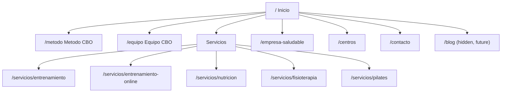

# Salud CBO — Astro Revamp Plan

## Current status (July 2025)

**Live preview:** [https://saludcbo.vercel.app](https://saludcbo.vercel.app) (Vercel project `saludcbo`, static Astro build)

### Done

| Area                                                                                                                   | Status |
| ---------------------------------------------------------------------------------------------------------------------- | ------ |
| Astro 7 + TypeScript + Tailwind CSS v4 + `@astrojs/sitemap`                                                            | ✅     |
| i18n (ES default at `/`, EN under `/en/`) + `hreflang` + language switcher                                             | ✅     |
| Design system (green brand palette, Inter, buttons, section utilities)                                                 | ✅     |
| Layout shell (`BaseLayout`, `Header`, `Footer`, floating WhatsApp button)                                              | ✅     |
| Content layer (`src/content.config.ts` + `src/data/{services,team,centers}.json` via `file()` loader)                  | ✅     |
| 29 static pages built and deployed                                                                                     | ✅     |
| Home, Método, Equipo, Centros, Contacto                                                                                | ✅     |
| Service pages (ES + EN): entrenamiento, entrenamiento-online, nutrición, fisioterapia, pilates, empresa saludable      | ✅     |
| Legal pages: `/aviso-legal`, `/privacidad`, `/cookies` + `/en/legal-notice`, `/en/privacy-policy`, `/en/cookie-policy` | ✅     |
| Blog scaffold (`/blog` route + placeholder collection entry)                                                           | ✅     |
| SEO basics: per-page meta, OG tags, `LocalBusiness` JSON-LD in `BaseLayout`                                            | ✅     |
| English URL slugs (e.g. `/en/services/training`, `/en/corporate-wellness`) with segment-aware `getAlternatePath()`     | ✅     |
| Real favicon (`public/favicon.jpg`) from saludcbo.com                                                                 | ✅     |
| Real logo (`public/logo.svg`) from saludcbo.com, used in Header and Footer                                            | ✅     |
| Real photography from saludcbo.com WordPress (`public/images/`) — hero, facilities, trainer                            | ✅     |
| Emoji replaced with `lucide-astro` icons throughout all pages and components                                          | ✅     |
| CI/CD pipeline (lint, format, typecheck, build) + Vercel deploy with PR previews                                      | ✅     |
| Pre-commit hook with `husky` + `lint-staged` (ESLint + Prettier on staged files)                                      | ✅     |

### Not done yet

| Area                                                                           | Notes                                                                      |
| ------------------------------------------------------------------------------ | -------------------------------------------------------------------------- |
| Custom domain (`www.saludcbo.com`)                                             | Point DNS to Vercel when ready to go live                                  |
| Contact form + Resend API route                                                | Deferred — `/contacto` shows phone/email/WhatsApp CTAs only                |
| Cookie consent banner + consent-gated embeds (Maps, Instagram, Google reviews) | Instagram/reviews are static placeholders or outbound links for now        |
| `/accesibilidad` and `/sitemap` HTML pages                                     | Footer links to legal pages exist; these two pages not built yet           |
| Brand colors / guidelines                                                      | Logo and photos scraped from existing site; official brand guidelines still TBD from owner |
| Real team/center data                                                          | `team.json` has Carlos; other roles are placeholders; Centro 2 address TBC |
| Testimonials collection                                                        | 3 reviews hardcoded on homepage                                            |
| `@astrojs/vercel` adapter                                                      | Not needed until API routes (contact form); site is fully static today     |
| WCAG-AA audit pass                                                             | Built with accessibility in mind; formal audit not run                     |
| Lead-magnet PDF delivery                                                       | CTA links to `/contacto`; no gated download flow yet                       |

### Repo notes

- Page logic lives in `src/components/pages/*.astro` with thin route stubs in `src/pages/` and `src/pages/en/` (DRY across locales).
- `nasty-nadir/` is leftover scaffolding from `npm create astro` (random project name). Only contains `.vscode` config — safe to delete.

---

## Overview

Rebuild [saludcbo.com](https://www.saludcbo.com/) as a clean, minimalist, bilingual (ES/EN) Astro site, deployed on Vercel. The revamp repositions CBO around **2 centers** and a **360º wellness approach** spanning four core services — Entrenamiento Personal, Fisioterapia, Nutrición, and Pilates — with stronger calls to action and a shift in voice from "Berni" (the founder) to **Equipo CBO** (the team), while preserving all current functionality (lead forms, reviews, Instagram feed, Google Maps, lead-magnet PDF download, legal pages). The site will be built accessible (WCAG AA) by default — no accessibility toolbar widget needed.

## Current site audit

The existing site is built on **WordPress + Elementor** (confirmed via markup: `elementor-form`, `wp-content`, `wp-json`, `wpcf7`), with the **Trustindex** plugin for Google reviews, an embedded Instagram feed, a WP accessibility-toolbar plugin, and Elementor Pro Forms/Contact Form 7 for lead capture (submissions emailed from WordPress).

### Pages / functionality inventory

| Page                    | Content / functionality                                                                                                                                                                                                                                                                                                                                                              |
| ----------------------- | ------------------------------------------------------------------------------------------------------------------------------------------------------------------------------------------------------------------------------------------------------------------------------------------------------------------------------------------------------------------------------------ |
| `/` Inicio              | Hero + CTA ("Solicitar información"), "Nuestra Experiencia" blurb, "Método CBO" teaser, "App CBO" teaser, budget-request CTA block, phone/email contact strip, Instagram feed embed, Google reviews (Trustindex, 19 reviews), free parking note, "5 Pilares" PDF lead magnet, footer (address, phone, email, legal links, accessibility, social, language switch, EU funding notice) |
| `/entrenamento-online/` | Entrenamiento personal y readaptación, grupos reducidos, Entrenamiento Online (App CBO) with a 3-step online process                                                                                                                                                                                                                                                                 |
| `/nutricion/`           | 4-step process (entrevista/valoración, composición corporal, plan dietético vía app, seguimiento continuo), "tipos de nutrición" (pérdida de grasa, rendimiento, educación, salud), online + presencial                                                                                                                                                                              |
| `/fisioterapia/`        | Terapia manual/kinesiotaping/punción seca, fisioterapia deportiva y traumatológica, ejercicio terapéutico, Pilates individual y en grupos reducidos (bundled in here today)                                                                                                                                                                                                          |
| `/empresa-saludable/`   | Corporate wellness programs: jornadas de prevención, consultas 1:1, programas adaptados, contact CTA                                                                                                                                                                                                                                                                                 |
| `/contacto/`            | "¿Quién soy?" (first-person Carlos bio), servicios complementarios (Fisioterapia, Pilates, Boxeo recreativo), contact form, office address/map, QR, socials                                                                                                                                                                                                                          |
| Legal/footer            | Aviso Legal, Política de privacidad, Política de cookies, Mapa del sitio, Accesibilidad, ES/EN language switcher, EU NextGenerationEU funding notice                                                                                                                                                                                                                                 |

### Key facts to carry forward

- Business: **Salud CBO** (Carlos Bernardo Osoro), Wellness/Fitness, est. ~2022, headquartered Oviedo/Lugones, Asturias.
- Currently expanding to **2 centers** in Lugones (per LinkedIn: new Pilates Reformer + Fisioterapia center hiring underway).
- Contact: `+34 667 828 851`, `cbo.salud@gmail.com`, address "P. El Castro, nave 2, Lugones (detrás de Tartiere Auto)".
- Social: Instagram `@cbo.salud`, LinkedIn.
- Trust signals: 19 Google reviews ("EXCELENTE"), 10 years / 1000+ people helped.
- Owner's stated goals: fit the site to "now" (2 centers, 360º health/wellness, EP + Fisio + Nutri + Pilates), cleaner/minimalist, better CTAs, and shift emphasis from Berni personally to **Equipo CBO** for growth.

## Why Astro (vs. alternatives considered)

- **Astro** (chosen): ships zero JS by default, best-in-class for content/marketing sites, native Markdown content collections, built-in i18n routing, trivial Vercel deploys, excellent SEO/Core Web Vitals out of the box. Interactivity (form, mobile nav, cookie consent) added only as small islands.
- Next.js: more capable but overkill — this site is 90% static content, not app logic.
- WordPress rebuild: would satisfy "team edits content" but the owner and I agreed on developer-managed content for now (see decisions below), so a heavier CMS isn't needed yet; also a full revamp is a good opportunity to leave WP/Elementor bloat behind.

## Confirmed decisions (from owner Q&A)

- **Content management**: developer-managed via Astro **content collections** (Markdown/JSON in the repo) — simplest and fastest; structured so a CMS can be layered on later if needed.
- **Languages**: **bilingual ES + EN**, ES as default locale at `/`, English under `/en/`, using Astro's built-in i18n routing + `hreflang` tags.
- **Hosting**: **Vercel** (static deploy). `@astrojs/vercel` adapter deferred until contact API routes are added.
- **Forms**: current setup is WordPress/Elementor Forms emailing the business inbox. Replacement: a serverless **Astro API route** that sends form submissions via **Resend** (email) to the business inbox, backed up with visible **WhatsApp/phone** CTAs throughout. (Owner to confirm final destination email/WhatsApp number.)
- **Blog**: not for this phase, but the content model and routing will leave room to add one later (useful given the volume of educational Instagram content that could be repurposed for SEO).
- **Third-party embeds**: keep **Instagram feed**, **Google reviews**, and **Google Maps**, gated behind a cookie-consent banner (GDPR-friendly since these are EU visitors) with lightweight static fallbacks shown before consent.

## Repositioning strategy (the actual "why" of this revamp)

1. **2 centers + 360º wellness framing** — Stop presenting the business as one trainer's practice; present it as a multidisciplinary health center with two physical locations and four integrated services (Entrenamiento, Fisioterapia, Nutrición, Pilates) that work together ("360º"). Pilates gets promoted from a bullet point buried in the Fisioterapia page to a **first-class service** with its own page.
2. **Cleaner / minimalist design** — Reduce visual noise: one accent color, generous whitespace, clear type hierarchy, fewer stacked CTAs competing for attention per section, consistent card/grid patterns across service pages instead of Elementor's ad-hoc sections.
3. **Stronger, consistent CTAs** — Standardize on one primary conversion action (e.g., "Reserva tu valoración gratuita") used everywhere: sticky header button, hero, end of every service page, floating WhatsApp button, and the contact page — rather than the current mix of "Solicitar información", "Solicitar presupuesto", "Solicitar CITA", "Contacta con nosotros" competing with no clear hierarchy.
4. **Equipo CBO, not just Berni** — Replace the first-person "¿Quién soy?" narrative with a collective "Equipo CBO" identity: a new `/equipo` page introducing the full team (trainers, physio, nutritionist(s), Pilates instructor) with Carlos framed as founder/lead rather than the sole face of the business — needed so the business isn't capacity-capped by one person.

## Proposed sitemap

- `/` — Inicio: hero + primary CTA, "360º wellness" intro, 4-service grid, Método CBO teaser, Equipo CBO teaser, 2 centers strip, reviews, Instagram feed, lead-magnet, final CTA
- `/metodo` — Método CBO, dedicated page (owner wants more emphasis on the method)
- `/equipo` — Equipo CBO (new): team bios, credentials, philosophy
- `/servicios/entrenamiento` — Entrenamiento personal + readaptación, grupos reducidos
- `/servicios/entrenamiento-online` — Entrenamiento Online / App CBO
- `/servicios/nutricion` — Nutrición (4-step process, tipos de nutrición)
- `/servicios/fisioterapia` — Fisioterapia (terapia manual, deportiva, ejercicio terapéutico)
- `/servicios/pilates` — Pilates (new standalone page, individual + grupos reducidos)
- `/empresa-saludable` — Corporate wellness programs
- `/centros` — The 2 centers: addresses, photos, parking, maps, which services are offered where
- `/contacto` — Contact form, WhatsApp/phone, maps, socials
- Legal: `/aviso-legal`, `/privacidad`, `/cookies` (mirrored under `/en/legal-notice`, `/en/privacy-policy`, `/en/cookie-policy`); `/accesibilidad` and `/sitemap` still TBD
- `/blog` — hidden route + content collection scaffolded, not linked in nav yet

**English mirrors** (under `/en/`): same structure with translated slugs where appropriate — e.g. `/en/services/training`, `/en/corporate-wellness`, `/en/legal-notice`. Pages like `/en/metodo`, `/en/equipo`, `/en/centros`, `/en/contacto` keep the Spanish slug for simplicity.



## Tech stack (as built)

- **Astro 7** + **TypeScript**
- **Tailwind CSS v4** (`@tailwindcss/vite`) + **`@tailwindcss/typography`** (legal pages)
- Output mode **`static`** (no SSR/API routes yet)
- **Content collections** (`src/content.config.ts`): `services`, `team`, `centers`, `blog` (stub) — data in `src/data/*.json` arrays loaded via Astro 7 `file()` loader
- **i18n**: Astro built-in routing (`es` default, `en` under `/en/`); UI copy in `src/i18n/{es,en}.json`; `getAlternatePath()` translates URL segments between locales (e.g. `servicios/entrenamiento` ↔ `services/training`)
- **Contact form** _(deferred)_: `src/pages/api/contact.ts` + **Resend**
- **Third-party embeds** _(deferred)_: consent-gated Maps, Instagram, Google reviews
- **Accessibility**: semantic HTML, skip link, focus styles — no toolbar widget
- **SEO**: `@astrojs/sitemap`, per-page meta + OG, `hreflang`, `LocalBusiness` JSON-LD (single center for now)
- **CI/CD**: GitHub Actions — `ci.yml` (lint, format, typecheck, build) + `deploy.yml` (Vercel preview/production)
- **Pre-commit**: `husky` + `lint-staged` (ESLint + Prettier on staged files before commit)

## Key files/structure (actual)

```
astro.config.mjs                    # i18n, sitemap, Tailwind
src/content.config.ts               # Astro 7 content layer (file + glob loaders)
src/data/{services,team,centers}.json
src/layouts/BaseLayout.astro        # head/meta/SEO, header, footer, JSON-LD
src/components/
  Header.astro, Footer.astro, WhatsAppButton.astro, ServiceCard.astro, ServicePage.astro
  pages/                            # shared page components (IndexPage, MetodoPage, etc.)
src/pages/                          # ES route stubs
src/pages/en/                       # EN route stubs
  services/{training,online-training,nutrition,physiotherapy,pilates}.astro
  corporate-wellness.astro
  legal-notice.astro, privacy-policy.astro, cookie-policy.astro
src/i18n/{es,en}.json, utils.ts
src/styles/global.css
```

Still to add: `ContactForm.astro`, `CookieConsent.astro`, `api/contact.ts`, embed components, `/accesibilidad`, `/sitemap`.

## Information / assets still needed from the owner (non-blocking for scaffolding)

- Logo files (SVG) and brand colors/guidelines, if any exist beyond the current green.
- Exact details for **both centers**: addresses, hours, parking, which services run at each.
- Team roster: names, roles, credentials, and photos for the `/equipo` page.
- Real photography of facilities/sessions to replace stock imagery.
- Confirmed destination email and WhatsApp number for lead capture.
- Direction on the "5 Pilares" PDF lead magnet: keep it gated and delivered by email?

## Build order

1. ~~Scaffold Astro + TypeScript + Tailwind v4 + sitemap + i18n config~~ ✅
2. ~~Design system: colors, type scale, spacing, buttons~~ ✅
3. ~~Layout shell: BaseLayout, Header, Footer, WhatsApp button~~ ✅
4. ~~Content model: collections + migrate copy into JSON arrays~~ ✅
5. ~~Build Inicio (home page)~~ ✅
6. ~~Build service pages (ES + EN)~~ ✅
7. ~~Build `/metodo` and `/equipo`~~ ✅
8. ~~Build `/centros` and `/contacto`~~ ✅
9. ~~Legal pages (aviso legal, privacidad, cookies)~~ ✅
10. ~~Scaffold hidden `/blog` route + collection~~ ✅
11. ~~Deploy to Vercel (preview)~~ ✅ — [saludcbo.vercel.app](https://saludcbo.vercel.app)
12. ~~Scrape real assets from WordPress site~~ ✅ — favicon, logo, hero/facility/trainer photos
13. ~~Lucide icons replacing emoji throughout~~ ✅
14. ~~CI/CD + Vercel deploy workflows + pre-commit hooks~~ ✅
15. **Next:** Custom domain `www.saludcbo.com` on Vercel
16. _(Deferred)_ Contact/lead-magnet API route with Resend + `@astrojs/vercel` adapter
17. _(Deferred)_ Consent-gated embeds (Instagram, reviews, Maps) + cookie consent banner
18. _(Deferred)_ `/accesibilidad`, `/sitemap` HTML pages; testimonials collection; WCAG-AA audit; JSON-LD for both centers

## Open design note

Brand assets have been scraped from the existing WordPress site — the favicon, SVG logo (`negro-cbo.svg`), and photography for hero sections, facilities, and the team page. The green brand palette from the original site has been kept and extended with an amber accent palette for CTA differentiation. Official brand guidelines from the owner are still pending.

## Similar sites

- https://trainingclub.es/
- https://www.wellcentro.com/
- https://clubmetropolitan.com/
- https://www.weonclub.com/
- https://innerflow.es/
