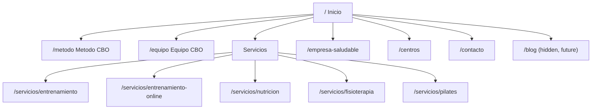

# Salud CBO — Astro Revamp Plan

## Overview

Rebuild [saludcbo.com](https://www.saludcbo.com/) as a clean, minimalist, bilingual (ES/EN) Astro site, deployed on Vercel. The revamp repositions CBO around **2 centers** and a **360º wellness approach** spanning four core services — Entrenamiento Personal, Fisioterapia, Nutrición, and Pilates — with stronger calls to action and a shift in voice from "Berni" (the founder) to **Equipo CBO** (the team), while preserving all current functionality (lead forms, reviews, Instagram feed, Google Maps, lead-magnet PDF download, legal pages). The site will be built accessible (WCAG AA) by default — no accessibility toolbar widget needed.

## Current site audit

The existing site is built on **WordPress + Elementor** (confirmed via markup: `elementor-form`, `wp-content`, `wp-json`, `wpcf7`), with the **Trustindex** plugin for Google reviews, an embedded Instagram feed, a WP accessibility-toolbar plugin, and Elementor Pro Forms/Contact Form 7 for lead capture (submissions emailed from WordPress).

### Pages / functionality inventory

| Page | Content / functionality |
|---|---|
| `/` Inicio | Hero + CTA ("Solicitar información"), "Nuestra Experiencia" blurb, "Método CBO" teaser, "App CBO" teaser, budget-request CTA block, phone/email contact strip, Instagram feed embed, Google reviews (Trustindex, 19 reviews), free parking note, "5 Pilares" PDF lead magnet, footer (address, phone, email, legal links, accessibility, social, language switch, EU funding notice) |
| `/entrenamento-online/` | Entrenamiento personal y readaptación, grupos reducidos, Entrenamiento Online (App CBO) with a 3-step online process |
| `/nutricion/` | 4-step process (entrevista/valoración, composición corporal, plan dietético vía app, seguimiento continuo), "tipos de nutrición" (pérdida de grasa, rendimiento, educación, salud), online + presencial |
| `/fisioterapia/` | Terapia manual/kinesiotaping/punción seca, fisioterapia deportiva y traumatológica, ejercicio terapéutico, Pilates individual y en grupos reducidos (bundled in here today) |
| `/empresa-saludable/` | Corporate wellness programs: jornadas de prevención, consultas 1:1, programas adaptados, contact CTA |
| `/contacto/` | "¿Quién soy?" (first-person Carlos bio), servicios complementarios (Fisioterapia, Pilates, Boxeo recreativo), contact form, office address/map, QR, socials |
| Legal/footer | Aviso Legal, Política de privacidad, Política de cookies, Mapa del sitio, Accesibilidad, ES/EN language switcher, EU NextGenerationEU funding notice |

### Key facts to carry forward
- Business: **Salud CBO** (Carlos Bernardo Osoro), Wellness/Fitness, est. ~2022, headquartered Oviedo/Lugones, Asturias.
- Currently expanding to **2 centers** in Lugones (per LinkedIn: new Pilates Reformer + Fisioterapia center hiring underway).
- Contact: `+34 667 828 851`, `cbo.salud@gmail.com`, address "P. El Castro, nave 2, Lugones (detrás de Tartiere Auto)".
- Social: Instagram `@cbo.salud`, LinkedIn.
- Trust signals: 19 Google reviews ("EXCELENTE"), 10 years / 1000+ people helped.
- Owner's stated goals: fit the site to "now" (2 centers, 360º health/wellness, EP + Fisio + Nutri + Pilates), cleaner/minimalist, better CTAs, and shift emphasis from Berni personally to **Equipo CBO** for growth.

## Why Astro (vs. alternatives considered)

- **Astro** (chosen): ships zero JS by default, best-in-class for content/marketing sites, native Markdown content collections, built-in i18n routing, trivial Vercel deploys, excellent SEO/Core Web Vitals out of the box. Interactivity (form, mobile nav, cookie consent) added only as small islands.
- Next.js: more capable but overkill — this site is 90% static content, not app logic.
- WordPress rebuild: would satisfy "team edits content" but the owner and I agreed on developer-managed content for now (see decisions below), so a heavier CMS isn't needed yet; also a full revamp is a good opportunity to leave WP/Elementor bloat behind.

## Confirmed decisions (from owner Q&A)

- **Content management**: developer-managed via Astro **content collections** (Markdown/JSON in the repo) — simplest and fastest; structured so a CMS can be layered on later if needed.
- **Languages**: **bilingual ES + EN**, ES as default locale at `/`, English under `/en/`, using Astro's built-in i18n routing + `hreflang` tags.
- **Hosting**: **Vercel**, using `@astrojs/vercel`.
- **Forms**: current setup is WordPress/Elementor Forms emailing the business inbox. Replacement: a serverless **Astro API route** that sends form submissions via **Resend** (email) to the business inbox, backed up with visible **WhatsApp/phone** CTAs throughout. (Owner to confirm final destination email/WhatsApp number.)
- **Blog**: not for this phase, but the content model and routing will leave room to add one later (useful given the volume of educational Instagram content that could be repurposed for SEO).
- **Third-party embeds**: keep **Instagram feed**, **Google reviews**, and **Google Maps**, gated behind a cookie-consent banner (GDPR-friendly since these are EU visitors) with lightweight static fallbacks shown before consent.

## Repositioning strategy (the actual "why" of this revamp)

1. **2 centers + 360º wellness framing** — Stop presenting the business as one trainer's practice; present it as a multidisciplinary health center with two physical locations and four integrated services (Entrenamiento, Fisioterapia, Nutrición, Pilates) that work together ("360º"). Pilates gets promoted from a bullet point buried in the Fisioterapia page to a **first-class service** with its own page.
2. **Cleaner / minimalist design** — Reduce visual noise: one accent color, generous whitespace, clear type hierarchy, fewer stacked CTAs competing for attention per section, consistent card/grid patterns across service pages instead of Elementor's ad-hoc sections.
3. **Stronger, consistent CTAs** — Standardize on one primary conversion action (e.g., "Reserva tu valoración gratuita") used everywhere: sticky header button, hero, end of every service page, floating WhatsApp button, and the contact page — rather than the current mix of "Solicitar información", "Solicitar presupuesto", "Solicitar CITA", "Contacta con nosotros" competing with no clear hierarchy.
4. **Equipo CBO, not just Berni** — Replace the first-person "¿Quién soy?" narrative with a collective "Equipo CBO" identity: a new `/equipo` page introducing the full team (trainers, physio, nutritionist(s), Pilates instructor) with Carlos framed as founder/lead rather than the sole face of the business — needed so the business isn't capacity-capped by one person.

## Proposed sitemap

- `/` — Inicio: hero + primary CTA, "360º wellness" intro, 4-service grid, Método CBO teaser, Equipo CBO teaser, 2 centers strip, reviews, Instagram feed, lead-magnet, final CTA
- `/metodo` — Método CBO, dedicated page (owner wants more emphasis on the method)
- `/equipo` — Equipo CBO (new): team bios, credentials, philosophy
- `/servicios/entrenamiento` — Entrenamiento personal + readaptación, grupos reducidos
- `/servicios/entrenamiento-online` — Entrenamiento Online / App CBO
- `/servicios/nutricion` — Nutrición (4-step process, tipos de nutrición)
- `/servicios/fisioterapia` — Fisioterapia (terapia manual, deportiva, ejercicio terapéutico)
- `/servicios/pilates` — Pilates (new standalone page, individual + grupos reducidos)
- `/empresa-saludable` — Corporate wellness programs
- `/centros` — The 2 centers: addresses, photos, parking, maps, which services are offered where
- `/contacto` — Contact form, WhatsApp/phone, maps, socials
- Legal: `/aviso-legal`, `/privacidad`, `/cookies`, `/accesibilidad`, `/sitemap` (mirrored under `/en/...`)
- `/blog` — hidden route + content collection scaffolded, not linked in nav yet



## Tech stack

- **Astro** (latest) + **TypeScript**
- **Tailwind CSS v4** for the design system
- Output mode `static`, with the **`@astrojs/vercel`** adapter enabling SSR only where required (the contact API route)
- **Content collections** (`src/content/`): `services`, `team`, `centers`, `testimonials`, `blog` (stub) — each with ES/EN fields or per-locale entries
- **i18n**: Astro's built-in i18n routing (`es` default, `en` secondary); shared UI copy in `src/i18n/{es,en}.json` dictionaries; a `LangSwitcher` component in header/footer
- **Contact form**: `src/pages/api/contact.ts` (POST) — validates input, sends via **Resend**, includes a honeypot field and basic rate limiting; works as a plain HTML POST and is progressively enhanced with a small client-side script for inline success/error states
- **Third-party embeds (consent-gated)**: Google Maps, Instagram feed (official embed or a lightweight widget), Google reviews widget — all deferred behind a cookie-consent banner, with static fallbacks (curated testimonial quotes, a map screenshot) shown by default
- **Accessibility**: built to WCAG AA by default — semantic HTML, visible focus states, sufficient contrast, descriptive alt text. No accessibility toolbar widget.
- **SEO**: `@astrojs/sitemap`, per-page meta + Open Graph tags, `hreflang` alternates for ES/EN, `LocalBusiness`/`HealthClub` JSON-LD structured data for **both** centers

## Key files/structure to create

```
astro.config.mjs               # i18n, Vercel adapter, sitemap, Tailwind
src/layouts/BaseLayout.astro   # head/meta/SEO, header, footer, consent
src/components/
  Header.astro                 # sticky nav, primary CTA, services dropdown, lang switcher
  Footer.astro                 # contact, legal links, socials, EU funding notice
  Hero.astro
  ServiceCard.astro
  CTA.astro
  TeamGrid.astro
  CenterCard.astro
  Reviews.astro
  InstagramFeed.astro
  MapEmbed.astro
  ContactForm.astro             # deferred to a later phase
  CookieConsent.astro
  LangSwitcher.astro
src/content/
  config.ts
  services/*.md
  team/*.md
  centers/*.md
  testimonials/*.md
  blog/*.md (stub)
src/pages/
  index.astro, metodo.astro, equipo.astro,
  servicios/{entrenamiento,entrenamiento-online,nutricion,fisioterapia,pilates}.astro,
  empresa-saludable.astro, centros.astro, contacto.astro,
  aviso-legal.astro, privacidad.astro, cookies.astro, accesibilidad.astro, sitemap.astro,
  en/**                        # mirrored EN routes
  api/contact.ts                # Resend form handler
src/i18n/{es,en}.json
```

## Information / assets still needed from the owner (non-blocking for scaffolding)

- Logo files (SVG) and brand colors/guidelines, if any exist beyond the current green.
- Exact details for **both centers**: addresses, hours, parking, which services run at each.
- Team roster: names, roles, credentials, and photos for the `/equipo` page.
- Real photography of facilities/sessions to replace stock imagery.
- Confirmed destination email and WhatsApp number for lead capture.
- Direction on the "5 Pilares" PDF lead magnet: keep it gated and delivered by email?

## Build order

1. Scaffold Astro + TypeScript + Tailwind v4 + Vercel adapter + sitemap + i18n config
2. Design system: colors (green accent + neutrals), type scale, spacing, buttons, CTA component
3. Layout shell: BaseLayout, Header (sticky CTA, services dropdown, lang switcher), Footer
4. Content model: define collections and migrate existing copy into ES/EN entries
5. Build Inicio (home page)
6. Build service pages: entrenamiento, entrenamiento-online, nutricion, fisioterapia, pilates, empresa-saludable
7. Build `/metodo` and `/equipo`
8. Build `/centros` and `/contacto`
9. *(Deferred)* Implement the contact/lead-magnet API route with Resend — the `/contacto` page will show a simple WhatsApp/phone/email CTA in the meantime
10. Wire up consent-gated embeds (Instagram, reviews, Maps) + cookie consent banner
11. Complete ES/EN translations, language switcher, hreflang
12. WCAG-AA audit pass, legal pages, SEO meta/OG + JSON-LD
13. Scaffold hidden `/blog` route + collection for future use
14. Deploy to Vercel, configure Resend env vars, verify forms/embeds/i18n in production

## Open design note

No brand assets have been provided yet. The initial build will use CBO's existing green ("Elige salud") as the single accent color on a neutral palette, with real logo and photography swapped in once the owner provides them.
